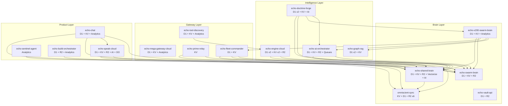

# Echo Workers Fleet

> 17 hardened Cloudflare Workers powering the Echo Omega Prime autonomous AI ecosystem

## Architecture

The Echo Workers Fleet forms a layered service mesh running entirely on Cloudflare's edge network. At the foundation, the **Brain Layer** (Shared Brain, Omniscient Sync, Swarm Brain, X200 Swarm Brain, Vault API) provides persistent memory, cross-instance synchronization, multi-agent swarm orchestration, and credential management. The **Intelligence Layer** (AI Orchestrator, Doctrine Forge, Graph RAG, Engine Cloud) handles multi-model AI routing, doctrine generation, knowledge graph traversal, and engine runtime with tiered API access. The **Gateway Layer** (Mega Gateway, Prime Relay, Fleet Commander, Tool Discovery) exposes 35,809+ tools through a unified API, relays events, monitors fleet health, and indexes 24.8M functions. The **Product Layer** (Chat, Sentinel Agent, Speak Cloud, Build Orchestrator) powers conversational AI, security monitoring, voice synthesis, and the CI/CD build pipeline.

Workers communicate via Cloudflare service bindings (zero-latency, no public URL), with service bindings creating a dense mesh of direct worker-to-worker connections.



## Workers

| Worker | Purpose | Endpoints | Bindings | Crons |
|--------|---------|-----------|----------|-------|
| [echo-shared-brain](workers/echo-shared-brain/) | Universal context manager -- D1+KV+R2+Vectorize, semantic search, mobile dashboard | 50+ | D1, KV, R2, Vectorize, AI, 3 services | 3 |
| [echo-swarm-brain](workers/echo-swarm-brain/) | Agent swarm orchestration -- 1,200 agents, Trinity Council, MoltBook, LLM routing | 137 | D1, KV, R2, 1 service | 1 |
| [echo-x200-swarm-brain](workers/echo-x200-swarm-brain/) | Trinity multi-AI swarm -- 200 agents, 13 providers, consensus voting | 23 | D1, KV, Analytics, 11 services | -- |
| [echo-fleet-commander](workers/echo-fleet-commander/) | Fleet monitoring and command -- health scanning, incidents, topology | 50+ | D1, KV, 5 services | 5 |
| [echo-mega-gateway-cloud](workers/echo-mega-gateway-cloud/) | Universal dynamic API proxy -- D1-driven, 1,878 servers, 35,809 tools | 28 | D1, KV, Analytics | -- |
| [echo-graph-rag](workers/echo-graph-rag/) | Graph RAG knowledge graph -- 312K nodes, traversal, community detection | 35 | 2 D1, KV | -- |
| [echo-prime-relay](workers/echo-prime-relay/) | Service mesh relay -- fan-out, subscriptions, 655 tools | 35 | KV, 5 services | -- |
| [echo-ai-orchestrator](workers/echo-ai-orchestrator/) | Multi-model AI orchestration -- 29 providers, failover, queue-based builds | 29 | D1, KV, R2, Queues, 2 services, Analytics | -- |
| [echo-doctrine-forge](workers/echo-doctrine-forge/) | Autonomous doctrine generation -- 10-forge fleet, Raistlin AI oversight | 47 | 2 D1, AI, KV, 5 services | 1 |
| [echo-speak-cloud](workers/echo-speak-cloud/) | Smart TTS router -- ElevenLabs, Edge TTS, GPU, 39 voices, emotion engine | 20+ | D1, KV, R2, AI, Durable Object, 4 services | -- |
| [echo-chat](workers/echo-chat/) | Multi-site conversational AI -- personality engine, memory cortex, voice output | 19 | D1, KV, Analytics, 14 services | 1 |
| [echo-build-orchestrator](workers/echo-build-orchestrator/) | CI/CD pipeline -- phased engine builds, quality gates, cloud builds | 28 | D1, R2, 2 services, Analytics | 1 |
| [echo-engine-cloud](workers/echo-engine-cloud/) | Engine runtime -- tiered API access, doctrine queries, 78+ engines | 74 | 2 D1, 2 KV, R2, 6 services, Analytics | 1 |
| [echo-tool-discovery](workers/echo-tool-discovery/) | Tool catalog -- 24.8M functions indexed, searchable, auto-updated | 31 | D1, KV, 3 services, Analytics | 2 |
| [omniscient-sync](workers/omniscient-sync/) | Cross-instance sync -- todos, policies, broadcasts, sessions, R2 bridge | 67 | KV, D1, 6 R2 buckets, Analytics | -- |
| [echo-sentinel-agent](workers/echo-sentinel-agent/) | Security monitoring -- threat detection, anomaly alerting, knowledge retrieval | 20 | 3 services, Analytics | -- |
| [echo-vault-api](workers/echo-vault-api/) | Credential vault -- 1,527+ secrets, audit trail, encrypted R2 backup | 30 | D1, R2 | -- |

## Security Standards

All workers in this fleet follow a hardened security baseline:

- **Authentication**: All endpoints except `/health` require `X-Echo-API-Key` header
- **Timing-safe comparison**: API key validation uses constant-time comparison to prevent timing attacks
- **503 on missing config**: Workers return 503 (not 500) if API key secret is not configured
- **Rate limiting**: Per-IP rate limiting on all endpoints (60-120 req/min depending on worker)
- **CORS allowlist**: Origin validation against explicit allowlist (echo-ept.com, echo-op.com, etc.)
- **Error sanitization**: No raw error messages, stack traces, or internal details returned to clients
- **Security headers**: HSTS, X-Frame-Options DENY, X-Content-Type-Options nosniff, CSP, Referrer-Policy
- **Parameterized queries**: All D1 SQL uses bind variables (no string interpolation)
- **SSRF protection**: URL validation and private IP blocking on proxy/browse endpoints
- **Path traversal protection**: File path validation with allowlists and `..` blocking
- **Body size limits**: Request body size caps (typically 512KB)
- **Audit trails**: Write operations logged to D1 audit tables

## Infrastructure

### Databases (D1)

| Database | Worker | Records |
|----------|--------|---------|
| echo-shared-brain | echo-shared-brain | 8,200+ memories |
| echo-build-orchestrator | echo-build-orchestrator | 875+ engines |
| echo-engine-doctrines | echo-doctrine-forge, echo-engine-cloud | Doctrines |
| echo-doctrine-forge | echo-doctrine-forge | Forge state |
| echo-graph-rag | echo-graph-rag | 312K+ nodes |
| echo-mega-gateway | echo-mega-gateway-cloud | 35,809+ tools |
| swarm-brain | echo-swarm-brain | 1,200 agents |
| echo-x200-swarm | echo-x200-swarm-brain | X200 agent state |
| echo-master-vault | echo-vault-api | 1,527+ secrets |
| omniscient-sync | omniscient-sync | Sessions, todos |
| echo-fleet-commander | echo-fleet-commander | Health records |
| echo-ai-orchestrator | echo-ai-orchestrator | Provider configs, usage |
| echo-chat | echo-chat | Conversations, sessions |
| echo-engine-cloud | echo-engine-cloud | Engine configs, API keys |
| echo-speak-cloud | echo-speak-cloud | Voice generation history |
| echo-tool-discovery | echo-tool-discovery | 24.8M+ tool index |
| echo-doctrines | echo-graph-rag | Source doctrines |

### KV Namespaces

Used by 14 workers for hot caching, rate limiting, session state, and fast lookups.

### R2 Buckets

| Bucket | Workers | Purpose |
|--------|---------|---------|
| echo-build-plans | echo-ai-orchestrator, echo-build-orchestrator | Build plans and engine source |
| echo-prime-memory | echo-shared-brain, omniscient-sync | Memory archives |
| echo-prime-master-vault | echo-vault-api | Credential backups |
| echo-prime-vault | echo-engine-cloud, omniscient-sync | Audit trails |
| echo-swarm-brain | echo-swarm-brain, omniscient-sync | Agent artifacts |
| echo-prime-media | echo-speak-cloud | Audio files |
| echo-prime-knowledge | omniscient-sync | Knowledge base |

### Service Bindings

Workers communicate internally via Cloudflare service bindings (zero-latency worker-to-worker calls, no public URL needed). Echo Chat has 14 service bindings, X200 Swarm Brain has 11, making them the most interconnected workers.

### Vectorize Indexes

| Index | Worker | Purpose |
|-------|--------|---------|
| shared-brain-embeddings | echo-shared-brain | Semantic memory search |

### Workers AI

Used by echo-shared-brain, echo-speak-cloud, and echo-doctrine-forge for embedding generation and on-edge LLM inference.

### Durable Objects

| Class | Worker | Purpose |
|-------|--------|---------|
| VoiceConversation | echo-speak-cloud | Stateful voice conversation sessions |

### Queues

| Queue | Worker | Purpose |
|-------|--------|---------|
| ai-orchestrator-builds | echo-ai-orchestrator | Async build job processing |
| ai-orchestrator-dlq | echo-ai-orchestrator | Dead letter queue for failed builds |

## Deployment

```bash
# Deploy a single worker
cd workers/echo-shared-brain
npx wrangler deploy

# Set secrets (required before first deploy)
npx wrangler secret put ECHO_API_KEY

# Tail logs
npx wrangler tail echo-shared-brain

# Deploy all workers
for dir in workers/*/; do
  echo "Deploying $(basename $dir)..."
  (cd "$dir" && npx wrangler deploy)
done
```

### Prerequisites

- Node.js 18+ and npm
- Wrangler CLI (`npm install -g wrangler`)
- Cloudflare account authenticated (`wrangler login`)
- Secrets configured for each worker (`wrangler secret put ECHO_API_KEY`)

## Organization

Built and maintained by **Echo Omega Prime** -- Commander Bobby Don McWilliams II.

All workers deploy to `*.bmcii1976.workers.dev` on the Cloudflare edge network.

- **GitHub**: [ECHO-OMEGA-PRIME/echo-workers-fleet](https://github.com/ECHO-OMEGA-PRIME/echo-workers-fleet)
- **Account**: Cloudflare account `bmcii1976`

## License

Proprietary -- Echo Omega Prime. All rights reserved.
